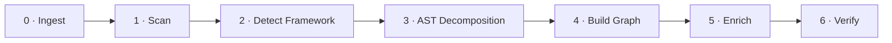

<div align="center">

# 🚀 Orchestrator Service

### A Java · Spring Boot · Spring AI based orchestrator for automated code processing


</div>

---

## 📖 Overview

This service processes source code through a **multi-step pipeline**. It accepts source input from either a **ZIP file** or a **Git repository**, decomposes the code into an **AST (Abstract Syntax Tree)**, builds a **dependency graph**, enriches the code semantically using **Google Gemini** via **Spring AI**, and finally **verifies** the result.

---

## 🛠️ Tech Stack

| Category | Technology |
| :--- | :--- |
| **Language** | Java 21 |
| **Framework** | Spring Boot |
| **Build Tool** | Gradle |
| **AI Layer** | Spring AI · Google Gemini |
| **RPC** | gRPC *(client configuration present)* |
| **Resilience** | Resilience4j *(configuration present)* |
| **Warm Cache** | Redis |
| **Cold Storage** | Cloud Storage |

> 💡 **Note:** Exact dependency versions are defined in `build.gradle`.

---

## 📦 Base Package

```
com.modernizer.orchestrator_service
```

---

## 🔄 Pipeline Steps

The orchestrator executes the following steps **in sequence**:



| # | Step | Description |
| :---: | :--- | :--- |
| **0** | Ingest | Ingest source (ZIP / Git) |
| **1** | Scan / Partition | Scan source |
| **2** | Detect Framework | Detect framework |
| **3** | AST Decomposition | Chunked AST |
| **4** | Build Graph | Build dependency graph |
| **5** | Enrichment | AI-based enrichment (Gemini) |
| **6** | Verification | Verify AST |

---

## 🗄️ Storage Model

The service uses a **3-tier storage approach** for AST data:

| Tier | Component | Backing Store |
| :--- | :--- | :--- |
| 🔥 **Hot** | `HotStore` | Pod memory |
| ⚡ **Warm** | `WarmStore` | Redis (metadata / pointers) |
| 💾 **Cold** | `ColdStore` | Cloud storage (AST chunks) |

> `AstStorageOrchestrator` coordinates data flow across all three tiers.

---

## 🏗️ Project Structure

```
src/main/java/com/modernizer/orchestrator_service/
│
├── OrchestratorServiceApplication.java   # Main entry point
│
├── config/          # Async, AI, gRPC, Resilience4j, Storage config
├── api/             # REST controller + DTOs
├── pipeline/        # Pipeline orchestrator, context, and steps
├── source/          # ZIP vs Git source abstraction + security
├── scan/            # Source scanning + framework detection
├── ast/             # AST adapters + chunking
├── graph/           # Dependency graph, cross-linking, topological sort
├── enrich/          # Semantic enrichment (Spring AI)
├── verify/          # AST verification
├── storage/         # 3-tier storage (Hot / Warm / Cold)
├── model/           # Records + enums
├── persistence/     # Entities, repository, job status
└── event/           # Event publishers
```

---

## 🚦 Getting Started

### ✅ Prerequisites

- ☕ **Java 21**
- 🔧 **Gradle**
- 🧠 **Redis** *(required for the warm storage tier)*

### ⚙️ Configuration

Configure the required environment variables before running:

```bash
# Google Gemini API key (required for AI enrichment)
export GEMINI_API_KEY="your-key"

# Redis connection (warm storage tier)
export REDIS_HOST="localhost"
export REDIS_PORT="6379"

# Cloud storage credentials (cold storage tier)
# export CLOUD_STORAGE_BUCKET="your-bucket"
```

### ▶️ Run the Application

```bash
./gradlew bootRun
```

### 🏗️ Build the Application

```bash
./gradlew clean build
```

---

## 🤝 Contributing

This is a private project. Contributions are limited to authorized team members.

---

## 📄 License

🔒 This project is **private and proprietary**. All rights reserved.

---

<div align="center">

**Built with ☕ Java 21 · 🍃 Spring Boot · 🤖 Spring AI · ✨ Google Gemini**

</div>
